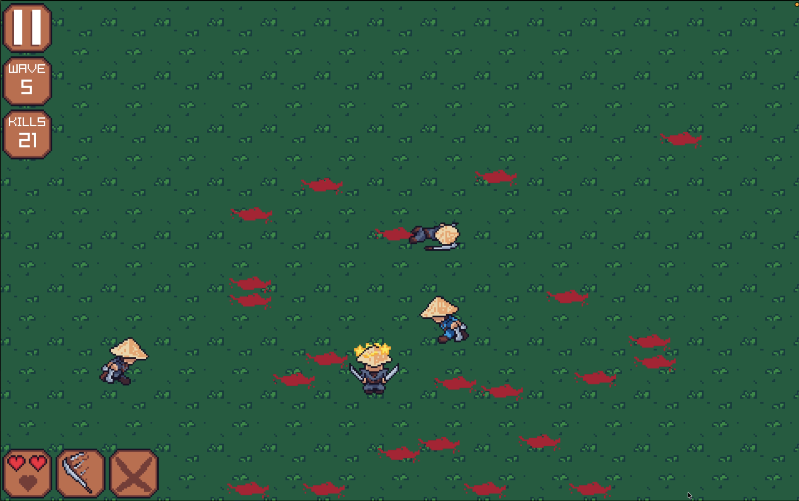

# Takaras Blade

**Takaras Blade** is a 2D game built in C++ using the raylib framework. The project focuses on building a modular game engine architecture while implementing core gameplay systems such as rendering, audio management, input handling, and page-based navigation.

The game is structured around a custom engine that separates responsibilities into distinct systems, including visual rendering and audio processing, along with a flexible page system that manages different game states like the home screen and gameplay. This approach emphasizes clean object-oriented design and scalability for future features.

All assets and systems in this project were created by me, including code, animations, and sound effects/music.

---

## Gameplay



---

## Architecture Overview

### GameEngine

* Controls the main game loop
* Handles page switching
* Initializes window and audio device

### Pages

* Represent different states of the game (Home & Play)
* Each page implements:

  * `update()` → logic
  * `draw()` → rendering
  * `resetPage()` → state reset

### Audio

* Manages sound effects and music
* Handles volume and playback control

### Visual

* Loads and manages textures
* Applies texture filtering (pixel-perfect scaling)
* Handles sprite rendering

---

## 🎮 Controls

* Mouse: UI interaction for all buttons
* Keyboard:
    - W, A, S, D -> Movement
    - Space Bar -> Dash
    - Shift -> Parry
    - R -> Restart Game
    - Tab -> Pause Game
    - P -> Switch Pages
    - esc -> Close Application

---

## Requirements

* C++17 or later
* [raylib](https://www.raylib.com/) installed

---

## Running the Project

1. Clone the repository:

   ```bash
   git clone https://github.com/ZachRadaza/TakarasBlade.git
   cd TakarasBlade
   ```

2. Build the project (example using g++):

   ```bash
   cmake -S . -B build
   cmake --build build -j
   ```

3. Run:

   ```bash
   ./build/MyRaylibGame
   ```

---

## Project Structure

```
TakarasBlade/
├── src/
│   ├── engine/        # GameEngine, Audio, Visual
│   ├── pages/         # Home, Play, Page base classes
│   └── entities/      # Entity, Character classes
|   └── GameEngine     # Main GameEngine class
├── assets/
│   ├── sprites/
│   └── audio/
├── main.cpp
```

---